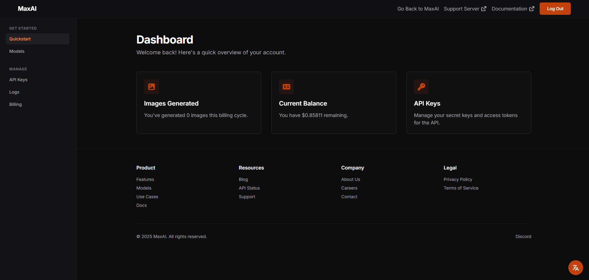
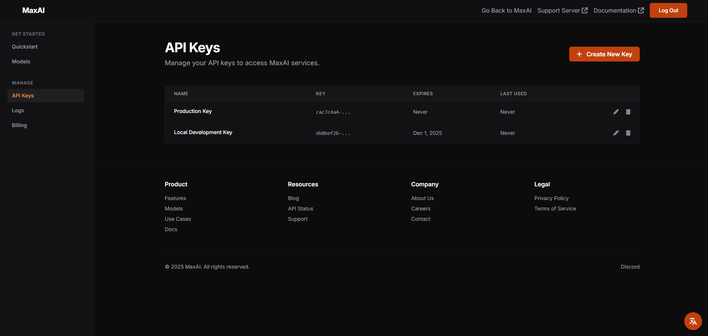
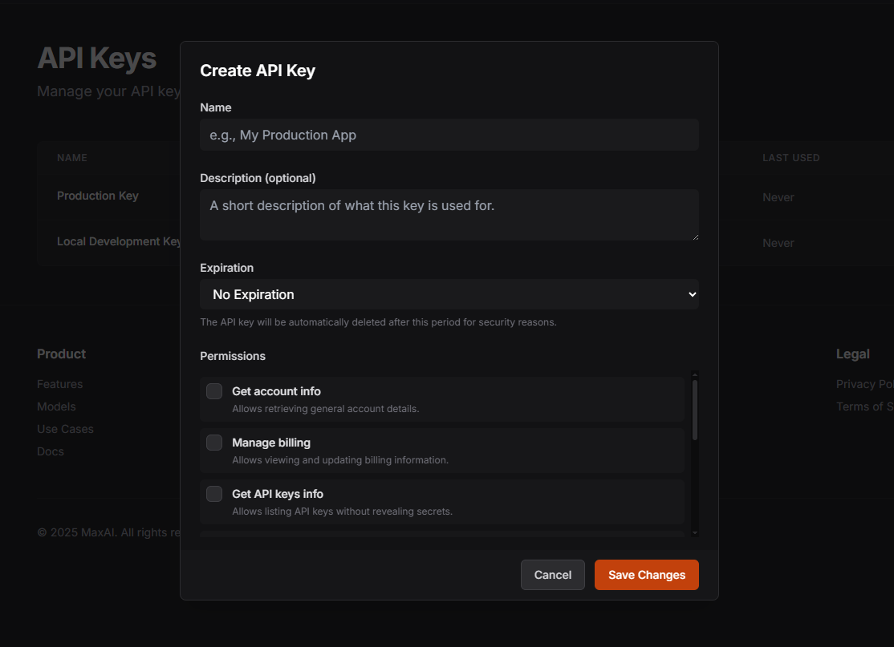
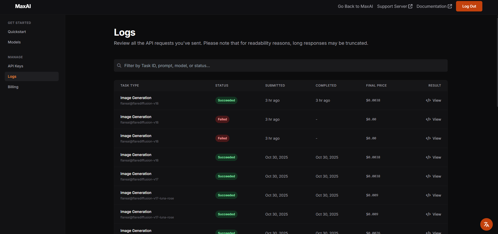
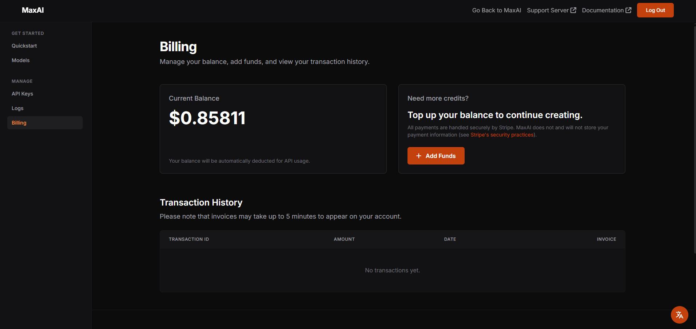

## Home Page
<Frame>
  
</Frame>
The dashboard home page provides a comprehensive overview of your recent activity, including the total number of requests made this month and your current account balance. You will also periodically find important announcements and updates from the MaxAI team in this section.

---

## API Keys
<Frame>
  
</Frame>
The API Keys section allows you to create, view, and manage your API keys. You can generate new keys for different projects and set their permissions to ensure secure access to the MaxAI services.

<Frame>
  
</Frame>
When creating a new API key, you can assign it a name, a description, an expiration date and specific permissions. Please note that once set, the expiration date cannot be modified.
<Warning>
For security reasons, API keys are displayed only once at the time of creation. If an API key is lost, our Support Team will not be able to recover it, and you will need to generate a new one.
</Warning>

---

## Logs
<Frame>
  
</Frame>
The Logs section provides a detailed view of all API requests made within your account. You can filter logs by date, request type, and status to quickly identify any issues or monitor usage patterns. Each log entry includes the full request response.

<Note>Video generation requests will not appear on the logging page until our next update, as this feature is still in beta. During this period, logging for video requests is not yet fully implemented.</Note>

---

## Billing
<Frame>
  
</Frame>
The Billing section provides an overview of your account balance and transaction history. You can view detailed invoices for each billing cycle, download them for your records, and top up your account balance as needed. Please note that invoices may take up to 5 minutes to be generated after a transaction is completed.

<Note>
All payments are securely handled through Stripe. Transactions are encrypted end-to-end, credit card details never touch our servers, and everything is protected by industry-standard PCI-DSS compliance and advanced fraud detection.
</Note>

<Check>
For customers looking to top-up via PayPal, please reach out to our Support Team in our <a href="https://support.maxai.lol" target="_blank">Discord server</a> for assistance.
</Check>